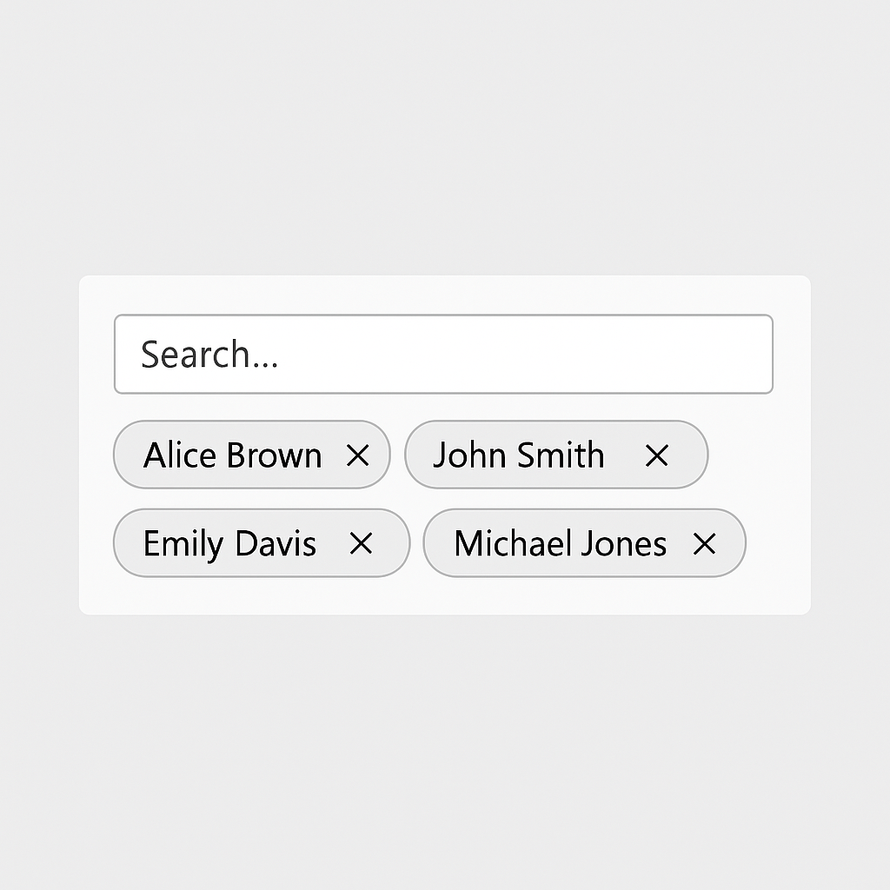
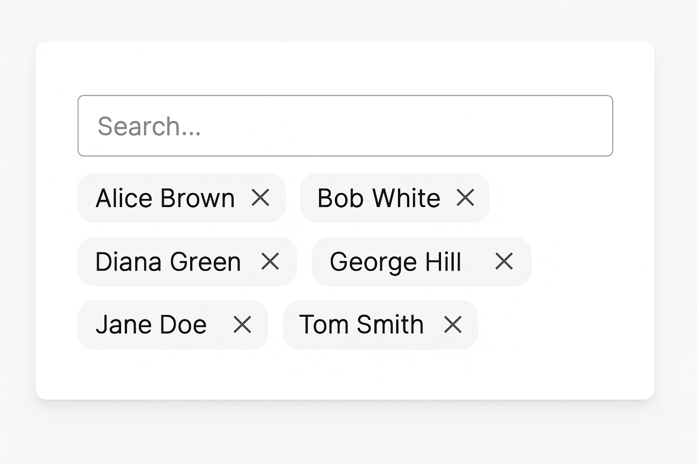

## MultiSelect Lookup Flex – PCF Control

### Motivation

One of the recurring challenges raised in the Power Apps community is the lack of a reliable **multi‑select lookup** experience in model‑driven apps.  Several third‑party PCF components exist, but many of them only work on forms and fail to render correctly in views or when the underlying field is displayed in read‑only mode.  This gap can be particularly frustrating when users need to select multiple related records via an N:N relationship and then review their selections in list views.

### Solution

`MultiSelect Lookup Flex` is a Power Apps Component Framework (PCF) control designed to address this issue.  It provides a polished multi‑select lookup interface that works both on forms (edit mode) and in views (read‑only mode).  In edit mode, it displays a search box with selectable chips representing chosen records.  In read‑only mode, it displays a comma‑separated list of the selected record names.  The control stores its values as a semicolon‑delimited string of record identifiers, making it compatible with standard `SingleLine.Text` fields.

### Features

- **Works in forms and views**: Renders chips for selected items on forms and a simple string representation in views.
- **Search interface**: Allows users to search and select related records using the Dataverse lookup API (placeholder implementation in this sample).
- **Configurable separator**: Developers can adjust the delimiter used for storage if needed.
- **Lightweight**: Written in TypeScript without external dependencies for ease of maintenance.

### Usage

To use this control in your environment:

1. Import the solution containing the PCF control into your environment.
2. Add the control to a `SingleLine.Text` column on your form and bind the `value` property to that column.
3. Publish and test the form.  Users can now select multiple related records, and the selections will appear both on the form and in views.

> **Note**: This repository provides a working skeleton of the control.  The lookup search functionality is stubbed out with a simple in‑memory list for demonstration purposes.  In a production environment you would call the Dataverse Web API or use the `context.factory.createGlobalContext().objectType` methods to retrieve and filter records.

### Screenshots

Below is a mockup of how the control looks when rendered in a form (edit mode) and when displayed in a view (read‑only):

| Mode | Image |
|---|---|
| **Edit (Form)** |  |
| **View (Read‑Only)** |  |

### Community issue reference

This control was inspired by discussions on the Power Apps community forum where users noted that existing multi‑select lookup PCF controls break when used in views【576018334007638†L0-L4】.  `MultiSelect Lookup Flex` aims to provide a more robust solution that behaves consistently across different contexts.

### Build instructions

1. Install the Power Apps CLI (`pac`) and Node.js.
2. Run `npm install` to install dependencies (if any).
3. Use `pac pcf push` to deploy the control to a test environment.

### License

This project is provided as‑is under the MIT License.  Feel free to fork, extend, and contribute enhancements.
